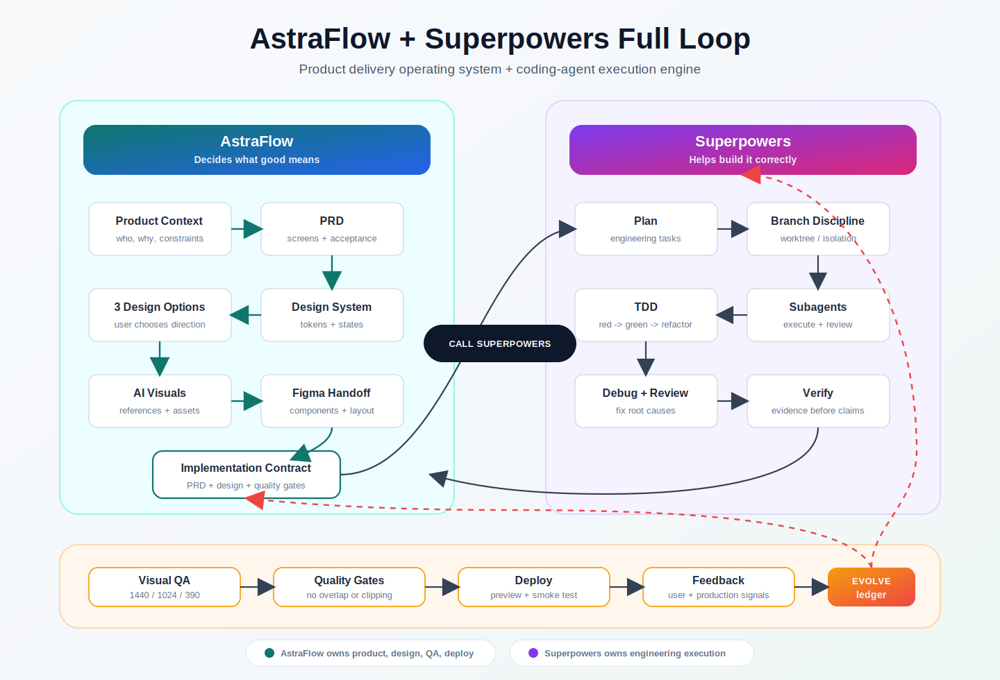

# AstraFlow

**AI-native project workflow blueprint for turning rough ideas into designed, tested, and deployable software.**

`idea -> PRD -> design direction -> design system -> AI visuals -> Figma handoff -> frontend -> visual QA -> tests -> fixes -> deployment`

## Quickstart

Give your project AstraFlow:
[Codex App](#codex-app),
[Codex CLI](#codex-cli),
[Claude Code](#claude-code),
[Cursor](#cursor),
[Gemini CLI](#gemini-cli),
[GitHub Copilot CLI](#github-copilot-cli),
[Kimi Code](#kimi-code),
[OpenCode](#opencode),
[Figma](#figma),
[Superpowers](#superpowers-integration).

Start with the [Core Prompt](#the-core-prompt), then let AstraFlow turn your idea into a PRD, design system, Figma-ready handoff, frontend implementation, visual QA, tests, fixes, and deployment readiness.



Most AI coding projects fail for the same reason: the AI is asked to build from a vague prompt, without stable product context, design rules, acceptance criteria, or quality gates.

AstraFlow fixes that.

It gives your project a structured operating system for AI agents, so product planning, UI design, implementation, testing, and deployment can happen as one repeatable workflow instead of a pile of disconnected prompts.

## Why AstraFlow

Modern AI tools are powerful, but most teams still use them like a chat box:

- "Make this page look better."
- "Build me an app."
- "Generate a design."
- "Fix the UI."
- "Deploy it."

That works for demos. It breaks for real products.

AstraFlow gives AI the missing project memory:

- what the product is
- who the users are
- what the screen must accomplish
- what design system to follow
- what files matter
- what visual issues are unacceptable
- what tests must pass
- how to prepare for Figma and deployment

Instead of asking AI to guess, AstraFlow teaches AI how your project thinks.

## What Problems It Solves

### 1. Vague Prompts Create Vague Products

AstraFlow replaces one-off prompting with structured project files:

- `AGENTS.md` for AI operating rules
- `docs/02-prd.md` for product requirements
- `docs/03-design-system.md` for design tokens and layout rules
- `docs/05-quality-gates.md` for acceptance criteria
- `prompts/` for reusable high-quality prompts

### 2. AI-Generated UI Often Looks Like a Demo

AstraFlow pushes AI toward commercial-grade product interfaces:

- realistic data
- real workflows
- loading, empty, error, disabled, hover, active, and selected states
- responsive layouts
- no clipped text
- no incoherent overlap
- no placeholder-heavy screens

### 3. Design And Engineering Drift Apart

AstraFlow connects:

- product brief
- PRD
- design system
- image generation
- Figma handoff
- frontend implementation
- visual regression checks

Design decisions become implementation constraints, not forgotten screenshots.

### 4. AI Agents Lose Context

AstraFlow gives every AI agent a read order and source of truth. Before changing anything, agents know which files to inspect and which quality rules to follow.

### 5. Shipping Requires More Than Code

AstraFlow includes testing, visual QA, asset management, and deployment checklists from the beginning.

## AstraFlow vs Superpowers

[obra/superpowers](https://github.com/obra/superpowers) is a strong software-development methodology for coding agents. It focuses on skills such as brainstorming, planning, test-driven development, subagent-driven development, code review, debugging, and verification before completion.

AstraFlow is different: it is an AI-native product delivery system.

Superpowers improves how an AI coding agent works. AstraFlow improves how an AI-native product project is structured from idea to design, Figma, frontend, QA, and deployment.

Use them together when you want both:

- Superpowers for engineering discipline inside the coding agent
- AstraFlow for product, design, visual QA, assets, Figma handoff, and deployment structure

Read the full comparison: [docs/06-positioning-vs-superpowers.md](docs/06-positioning-vs-superpowers.md)

See the full integration loop: [docs/08-full-loop-with-superpowers.md](docs/08-full-loop-with-superpowers.md)

## Use In Real Projects

AstraFlow has two practical modes:

1. **Project template**: copy the AstraFlow files into a real product repository so agents have project context, PRD, design rules, QA gates, and deployment checks.
2. **Codex skill**: install the bundled skill so Codex can apply the AstraFlow workflow in any repository.

Best setup:

```text
Install the AstraFlow skill globally
+ add AstraFlow project files to each serious product repo
= reusable AI workflow + durable project memory
```

### Install As A Skill

This repository includes a reusable Codex skill:

```text
skills/astraflow-project-delivery
```

To use it locally, copy that folder into your Codex skills directory:

```bash
mkdir -p ~/.codex/skills
cp -R skills/astraflow-project-delivery ~/.codex/skills/
```

Then ask Codex:

```text
Use AstraFlow on this project. I have a rough product idea, but I do not know how to write the prompt.
```

If a running Codex session does not notice the newly installed skill, start a new session or explicitly invoke:

```text
Use the astraflow-project-delivery skill on this project.
```

The skill will guide Codex through product planning, PRD, design system, Figma/image handoff, implementation contract, Superpowers handoff when appropriate, visual QA, deployment readiness, and self-evolution.

## Self-Evolution

AstraFlow is designed to improve itself over time.

Every repeated failure should become a durable project artifact:

- a stronger prompt
- a clearer product requirement
- a tighter design rule
- a better visual QA check
- a Figma handoff rule
- an asset pipeline constraint
- a test
- a deployment checklist item

The self-evolution loop is documented in [docs/07-self-evolution.md](docs/07-self-evolution.md), and changes are recorded in [docs/evolution/ledger.md](docs/evolution/ledger.md).

## Key Advantages

- **AI-first project structure**: Built for Codex, Cursor, Claude Code, Copilot, and other AI coding agents.
- **Promptless workflow**: Users can choose from options instead of writing perfect prompts.
- **Commercial UI quality bar**: Explicit rules for hierarchy, spacing, typography, responsive design, and anti-overlap QA.
- **Figma-ready handoff**: Includes Figma structure, component rules, Auto Layout guidance, and token mapping.
- **Image generation pipeline**: Defines where generated visuals, references, and production cut assets belong.
- **Quality gates included**: Product, design, frontend, visual QA, test, and deployment gates.
- **Stack-agnostic**: Works with any frontend or app framework.
- **Agent-readable**: Every major workflow is documented in plain files AI can reliably follow.
- **Open-ended by design**: Use it as a docs template, project bootstrap, CLI foundation, or Codex skill/plugin base.

## Who Should Use It

AstraFlow is for:

- indie hackers building with AI
- founders prototyping products
- design engineers creating polished interfaces
- product teams standardizing AI workflows
- agencies delivering client projects faster
- developers who want AI output to be more reliable
- teams turning Figma, screenshots, and product ideas into real software

## How It Works

```text
1. Capture product context
2. Generate or refine the PRD
3. Ask AI to propose 3 design directions
4. Choose a direction
5. Create a design system
6. Generate visual references or product imagery
7. Prepare Figma handoff
8. Implement real frontend screens
9. Run visual QA at desktop, tablet, and mobile sizes
10. Run tests, fix issues, and deploy
```

## Repository Structure

```text
.
├── AGENTS.md
├── docs/
│   ├── 00-project-context.md
│   ├── 01-product-brief.md
│   ├── 02-prd.md
│   ├── 03-design-system.md
│   ├── 04-ai-workflow.md
│   ├── 05-quality-gates.md
│   ├── 06-positioning-vs-superpowers.md
│   ├── 07-self-evolution.md
│   ├── 08-full-loop-with-superpowers.md
│   └── evolution/
├── prompts/
│   ├── design-prompt-assistant.md
│   ├── product-planning.md
│   ├── design-direction.md
│   ├── image-generation.md
│   ├── figma-generation.md
│   ├── frontend-implementation.md
│   └── visual-qa.md
├── figma/
│   └── figma-handoff.md
├── assets/
│   ├── asset-pipeline.md
│   ├── references/
│   ├── generated/
│   ├── cut/
│   └── icons/
├── qa/
│   ├── test-plan.md
│   └── visual-regression.md
├── skills/
│   └── astraflow-project-delivery/
└── deploy/
    └── deployment-checklist.md
```

## Quick Start

1. Clone or copy this repository.
2. Fill in `docs/00-project-context.md`.
3. Fill in `docs/01-product-brief.md`.
4. Ask your AI coding agent:

```text
Read AGENTS.md and the docs folder.
Use AstraFlow's workflow to turn this product idea into a PRD, 3 design directions, a design system, implementation plan, visual QA plan, and deployment checklist.
If anything is unclear, give me 3 options instead of asking me to write a perfect prompt.
```

5. Choose one design direction.
6. Let the AI continue through implementation and QA.

### Codex App

Open this repository in Codex App and ask:

```text
Read AGENTS.md and use AstraFlow to turn my idea into a product brief, PRD, design system, implementation contract, visual QA plan, and deployment checklist.
```

### Codex CLI

Run Codex from the repository root and start with the core prompt below. AstraFlow's `AGENTS.md` tells the agent what project context to read first.

### Claude Code

Open the repository in Claude Code and tell it to follow `AGENTS.md`, then use the AstraFlow docs as the project source of truth.

### Cursor

Open the repository in Cursor Agent and ask it to read `AGENTS.md` plus the `docs/` folder before changing code.

### Gemini CLI

Run Gemini CLI from the repository root and ask it to follow the AstraFlow workflow from `AGENTS.md`.

### GitHub Copilot CLI

Use the repository files as the source of truth, then ask Copilot CLI to generate plans or implementation changes from the PRD and design system.

### Kimi Code

Open the project in Kimi Code and ask it to follow the AstraFlow read order in `AGENTS.md`.

### OpenCode

Run OpenCode from the repository root and begin with the AstraFlow core prompt.

### Figma

Use `figma/figma-handoff.md` and `prompts/figma-generation.md` to create editable screens, components, variables, and handoff structure.

### Superpowers Integration

Use AstraFlow to define what good means, then use Superpowers as the engineering execution engine.

Read the full loop: [docs/08-full-loop-with-superpowers.md](docs/08-full-loop-with-superpowers.md)

## The Core Prompt

Use this when you do not know how to write a good prompt:

```text
I do not know how to write design or product prompts.

Use AstraFlow as a Design Prompt Assistant.

First, read AGENTS.md and the docs folder.
Then infer my product goal and give me 3 options:
A. Conservative/professional
B. Premium/product-led
C. Dense/operational

Explain the tradeoffs in plain language.
After I choose one, generate the full professional prompt automatically and execute the workflow:
product planning, PRD, design system, AI visual direction, Figma handoff plan, frontend implementation, visual QA, testing, fixes, and deployment readiness.
```

## Built-In Quality Gates

AstraFlow rejects weak AI output by default.

Before delivery, the project should pass:

- **Product gate**: clear users, workflow, and acceptance criteria
- **Design gate**: documented tokens, states, and responsive rules
- **Figma gate**: reusable components, clean layers, no overlap
- **Frontend gate**: no clipping, no broken layout, no missing critical states
- **Visual QA gate**: checked at 1440px, 1024px, and 390px
- **Test gate**: lint, typecheck, unit, integration, or e2e where applicable
- **Deployment gate**: build, preview, smoke test, rollback path

## Languages

Each language has its own README file, so the homepage stays focused while international users can jump to the version they prefer.

| Language | README |
| --- | --- |
| English | [i18n/README.en.md](i18n/README.en.md) |
| 中文 | [i18n/README.zh-CN.md](i18n/README.zh-CN.md) |
| 日本語 | [i18n/README.ja.md](i18n/README.ja.md) |
| 한국어 | [i18n/README.ko.md](i18n/README.ko.md) |
| Español | [i18n/README.es.md](i18n/README.es.md) |
| Français | [i18n/README.fr.md](i18n/README.fr.md) |
| Deutsch | [i18n/README.de.md](i18n/README.de.md) |
| Português | [i18n/README.pt-BR.md](i18n/README.pt-BR.md) |
| Русский | [i18n/README.ru.md](i18n/README.ru.md) |
| العربية | [i18n/README.ar.md](i18n/README.ar.md) |
| हिन्दी | [i18n/README.hi.md](i18n/README.hi.md) |

## Roadmap

- AstraFlow CLI: `astraflow init`, `astraflow plan`, `astraflow design`, `astraflow qa`, `astraflow deploy`
- Codex skill/plugin package
- Figma generation helpers
- Visual QA automation templates
- Example projects
- Multi-agent workflow templates

## License

Apache-2.0
