# Full Loop With Superpowers

This document shows how AstraFlow and Superpowers can work together without overlapping responsibilities.

## Core Idea

```text
AstraFlow = product delivery operating system
Superpowers = coding-agent execution engine
```

AstraFlow owns the end-to-end product delivery loop: product, design, Figma, assets, visual QA, deployment, and evolution.

Superpowers owns disciplined coding execution: planning, TDD, subagent-driven development, code review, debugging, and verification before completion.

## Full Closed Loop

```mermaid
flowchart TD
    A["Rough product idea"] --> B["AstraFlow: Project Context<br/>docs/00-project-context.md"]
    B --> C["AstraFlow: Product Brief<br/>docs/01-product-brief.md"]
    C --> D["AstraFlow: PRD<br/>docs/02-prd.md"]
    D --> E["AstraFlow: 3 Design Directions<br/>prompts/design-direction.md"]
    E --> F{"User chooses direction"}
    F --> G["AstraFlow: Design System<br/>docs/03-design-system.md"]
    G --> H["AstraFlow: Visual Direction<br/>prompts/image-generation.md<br/>assets/generated/"]
    H --> I["AstraFlow: Figma Handoff<br/>figma/figma-handoff.md"]
    I --> J["AstraFlow: Implementation Contract<br/>PRD + Design System + Quality Gates"]

    J --> K["Call Superpowers"]

    subgraph SP["Superpowers Execution Engine"]
        K --> L["Brainstorm / clarify engineering ambiguity"]
        L --> M["Write implementation plan"]
        M --> N["Use git worktree / branch discipline"]
        N --> O["TDD: red -> green -> refactor"]
        O --> P["Subagent-driven development"]
        P --> Q["Code review"]
        Q --> R["Systematic debugging if needed"]
        R --> S["Verification before completion"]
    end

    S --> T["AstraFlow: Frontend Acceptance<br/>real workflows + required states"]
    T --> U["AstraFlow: Visual QA<br/>1440px / 1024px / 390px"]
    U --> V{"Quality gates pass?"}
    V -- "No" --> W["Classify failure<br/>product / design / visual / Figma / asset / engineering / test / deploy"]
    W --> X["Update durable artifact<br/>docs / prompts / qa / figma / assets / deploy"]
    X --> Y["Record evolution<br/>docs/evolution/ledger.md"]
    Y --> J

    V -- "Yes" --> Z["AstraFlow: Deployment Checklist<br/>deploy/deployment-checklist.md"]
    Z --> AA["Preview deploy + smoke test"]
    AA --> AB{"Release ready?"}
    AB -- "No" --> W
    AB -- "Yes" --> AC["Production release"]
    AC --> AD["Post-release feedback"]
    AD --> W
```



## Responsibility Split

| Stage | AstraFlow Owns | Superpowers Owns |
| --- | --- | --- |
| Product idea | Convert rough idea into stable context | Not primary owner |
| Product brief | Audience, problem, workflow, success metrics | Not primary owner |
| PRD | Requirements, screens, acceptance criteria | Can refine ambiguity during planning |
| Design direction | 3 options, user choice, visual strategy | Not primary owner |
| Design system | Tokens, layout rules, component states | Must follow it during implementation |
| Image generation | Reference images, generated assets, cut assets | Not primary owner |
| Figma | Handoff structure, components, Auto Layout rules | Not primary owner |
| Implementation plan | Provides implementation contract | Breaks work into engineering tasks |
| Development | Defines what must be built | TDD, subagents, reviews, debugging |
| Verification | Defines product/design/visual gates | Enforces evidence before completion |
| Visual QA | Breakpoints, overlap, clipping, states | Can help execute fixes |
| Deployment | Checklist, preview, smoke test, rollback | Can verify build/test readiness |
| Evolution | Ledger, durable artifact updates | Skill/process improvement discipline |

## How AstraFlow Calls Superpowers

AstraFlow should call Superpowers only after the implementation contract is ready.

The contract should include:

- `docs/00-project-context.md`
- `docs/01-product-brief.md`
- `docs/02-prd.md`
- `docs/03-design-system.md`
- `docs/05-quality-gates.md`
- relevant prompts from `prompts/`
- Figma or asset requirements if the task touches UI

Recommended handoff prompt:

```text
Use Superpowers as the engineering execution engine for this AstraFlow implementation contract.

Read:
- AGENTS.md
- docs/00-project-context.md
- docs/01-product-brief.md
- docs/02-prd.md
- docs/03-design-system.md
- docs/05-quality-gates.md
- docs/08-full-loop-with-superpowers.md

Your job:
1. Resolve only engineering ambiguity.
2. Write an implementation plan from the PRD and design system.
3. Use TDD where code behavior is testable.
4. Use subagent-driven development when tasks are independent.
5. Review code against the AstraFlow requirements.
6. Verify before claiming completion.
7. Return implementation evidence, test evidence, and any gaps.

Do not replace AstraFlow's product, design, Figma, visual QA, asset, or deployment rules.
```

## What Superpowers Does In The Loop

Superpowers is most valuable once AstraFlow has defined the product and design target.

It contributes:

- disciplined planning
- smaller implementation tasks
- branch/worktree discipline
- TDD
- systematic debugging
- code review
- subagent execution
- verification before completion

This reduces engineering drift and false completion claims.

## What AstraFlow Adds Around Superpowers

AstraFlow adds the product delivery context Superpowers does not primarily target:

- product source of truth
- commercial-grade design direction
- design tokens and component states
- Figma handoff rules
- image and cut-asset governance
- visual QA gates
- deployment checklist
- self-evolution ledger

This reduces product/design drift and weak handoff.

## Why The Combination Is Stable

The loop is stable because each failure becomes structured input for the next run.

```text
Failure
-> classify
-> update durable artifact
-> verify
-> record in ledger
-> rerun from the correct stage
```

Examples:

| Failure | Next Stable Action |
| --- | --- |
| Requirement unclear | Update `docs/02-prd.md`, then rerun planning |
| UI looks generic | Update `docs/03-design-system.md`, then rerun design/implementation |
| Text overlaps on mobile | Update `docs/05-quality-gates.md` and `prompts/visual-qa.md`, then rerun visual QA |
| Figma layers are messy | Update `figma/figma-handoff.md`, then rerun handoff |
| Asset used incorrectly | Update `assets/asset-pipeline.md`, then recut or replace asset |
| Test missed regression | Update `qa/test-plan.md`, then rerun Superpowers execution |
| Deployment failed | Update `deploy/deployment-checklist.md`, then rerun deployment gate |

## When The Combination Gets Worse

The combination becomes worse if both systems try to own the same layer.

Avoid:

- letting Superpowers replace AstraFlow's product/design/Figma decisions
- letting AstraFlow micromanage TDD and code review mechanics
- duplicating brainstorm loops
- asking agents to read every file for every task
- treating visual QA as optional because tests passed
- claiming completion before both AstraFlow gates and Superpowers verification pass

## Recommended Rule

Use this rule in real projects:

```text
AstraFlow decides what good means.
Superpowers helps build it correctly.
Both must provide evidence before completion.
```

